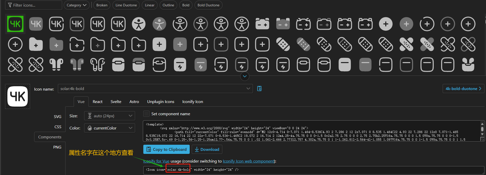

# Icon(图标)

## 概述
`se-icon` 是一个基于 `@iconify/iconify` 的 Vue 组件，专注于动态渲染图标。它提供了简洁的接口，允许用户自定义图标名称、大小、颜色等属性，从而满足灵活的需求。

Iconify 是一款功能强大的图标框架：
- 支持 100 多个图标集，涵盖 100,000+ 图标。
- 提供 SVG 框架、前端框架组件，以及设计工具插件（如 Figma、Sketch、Adobe XD）。
- 可通过 [Iconify Icon Finder](https://icon-sets.iconify.design/) 快速搜索和选择图标。



## 属性（Props）

| 属性名   | 类型   | 默认值  | 描述                                   |
|----------|--------|---------|----------------------------------------|
| `icon`   | String | 必填    | 图标名称，对应 Iconify 的图标标识符。    |
| `size`   | Number | `16`    | 图标大小，单位为 `px`。                 |
| `color`  | String | `"white"` | 图标颜色，支持任何 CSS 颜色值。         |

---

## 示例用法

### 1. 基本用法
渲染一个默认大小为 `16px`、颜色为白色的图标：
```vue
<se-icon icon="mdi:account" />
```

### 2. 自定义颜色和大小
指定图标大小和颜色：
```vue
<se-icon icon="mdi:account" size="32" color="blue" />
```

### 3. 在列表中动态生成多个图标
```vue
<template>
  <div>
    <se-icon 
      v-for="(icon, index) in icons" 
      :key="index" 
      :icon="icon" 
      size="24" 
      color="#555" 
    />
  </div>
</template>

<script lang="ts">
export default {
  data() {
    return {
      icons: ["mdi:home", "mdi:account", "mdi:settings"],
    };
  },
};
</script>
```
此示例展示了多个不同的图标。

---

## 样式
组件默认样式：
- **颜色**：由 `color` 属性控制。
- **大小**：由 `size` 属性定义，单位为像素。
- **布局**：使用 `inline-flex`，确保图标与文本居中对齐。


## 组件逻辑

1. **动态样式计算**  
   使用 Vue 的 `computed` 动态生成样式，根据 `size` 和 `color` 调整图标外观，确保样式响应式更新。

2. **图标渲染**
    - 使用 Iconify 的 `renderSVG` 方法生成高质量的 SVG 图标。
    - 如果无法生成 SVG，则使用备用机制，通过设置 `data-icon` 属性渲染占位图标。

3. **响应式更新**  
   组件挂载后自动调用 `updateIcon` 方法，确保图标渲染正常，并清理多余内容避免冗余。

4. **兼容性强**  
   即使在部分图标加载失败时，仍能保证占位内容的正常渲染，避免空白。


## 注意事项


1. **正确的图标标识符**  
   图标名称必须符合 Iconify 的标准格式，例如 `mdi:home`。

2. **覆盖默认样式**  
   如需调整样式，可通过修改 `.se-icon` 类实现自定义。

3. **检查图标库加载**  
   若某些图标无法显示，请确认所需的图标库是否正确加载。

---

更多图标库资源请访问 [Iconify 图标库](https://icon-sets.iconify.design/)。
